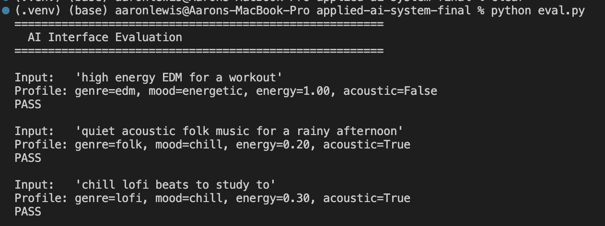
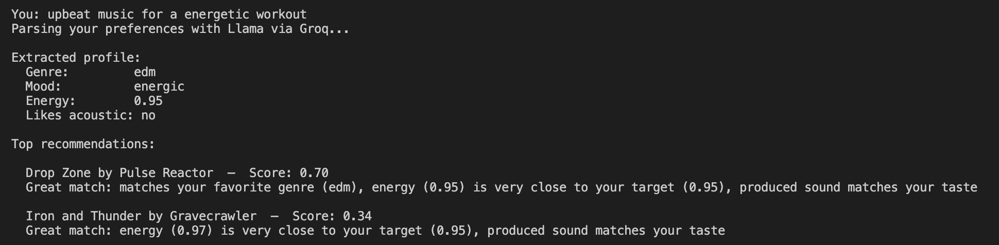
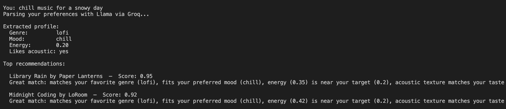
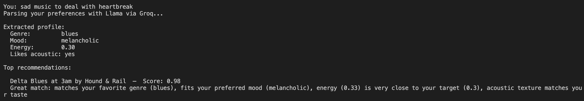

# Applied AI System — Extension Documentation

## Base Project and Original Scope

The original project was **ai-110-module3-musicrecommender**, a content-based music recommendation system built in Python. Its goal was to match songs from a static catalog to a user's taste profile using a deterministic scoring algorithm — no external APIs involved.

The system worked as follows:

- **Song catalog** — a CSV file (`data/songs.csv`) where each row contains a song's title, artist, genre, mood, energy, tempo, valence, danceability, and acousticness.
- **User profile** — a hardcoded Python dictionary with four fields: `genre`, `mood`, `energy` (float 0.0–1.0), and `likes_acoustic` (boolean).
- **Scoring** — `score_song()` compared a song against the user profile using a weighted formula: genre match (35%), mood match (30%), energy proximity (25%), and acoustic preference (10%). Categorical fields used binary match; numerical fields used proximity scoring (`1 - |difference|`).
- **Recommendations** — `recommend_songs()` scored every song in the catalog and returned the top-k results along with a plain-English explanation of why each song was selected.
- **Entry point** — `src/main.py` ran four hardcoded user profiles (pop fan, acoustic listener, EDM raver, lofi studier) and printed ranked recommendations for each.

The system was fully self-contained and rule-based: given the same profile, it always produced the same output. There was no user input and no external service calls.

---

## Extended System — What Was Added

The extension adds a **structured prompting** layer that lets users describe what they want to hear in plain English instead of filling out a rigid profile form. A free LLM (Llama 3.1 via Groq's API) parses the description into the same four-field profile the original recommender already understands, so the scoring logic required no changes.

### New Features

- **Natural language input** — type a description like "something chill to study to with acoustic guitar" and the system figures out the genre, mood, energy level, and acoustic preference for you.
- **AI parsing layer** (`src/ai_interface.py`) — sends the user's description to Llama 3.1 8B via Groq using a structured system prompt and returns a validated JSON profile.
- **Interactive CLI** (`src/main.py`) — replaces the hardcoded profiles with a live input loop. Users can describe as many moods as they want in one session and get fresh recommendations each time.
- **Evaluation script** (`eval.py`) — runs three representative descriptions through the AI layer and checks that the returned profiles are directionally correct (right genre, right energy range, right acoustic preference).

### How It Works

```
User types description
        ↓
src/main.py (CLI loop)
        ↓
src/ai_interface.py → Groq API (Llama 3.1 8B) → JSON profile
        ↓
src/recommender.py → scores every song → returns top 5
        ↓
Recommendations printed to terminal
```

---

## Setup and Usage

### 1. Get a free Groq API key

Sign up at [console.groq.com](https://console.groq.com) and copy your API key.

### 2. Create a `.env` file

In the project root, create a file named `.env` and add your API key:

```
GROQ_API_KEY=your_actual_key_here
```

### 3. Install dependencies

```bash
pip install -r requirements.txt
```

### 4. Run the recommender

```bash
python -m src.main
```

Then type a description when prompted. Examples:

```
You: something chill to study to with acoustic guitar
You: high energy EDM for a workout
You: sad rainy day indie music
```

Type `quit` to exit.

### 5. Run the evaluation script

```bash
python eval.py
```

This runs three sample inputs through the AI layer and reports whether each output profile matches expected characteristics. No manual inspection needed — it prints `PASS` or `FAIL` for each case. Below are the results of the evaluation script and the output matches what expected output for those sentences were.



### 6. Run the unit tests

```bash
pytest
```

This runs the original recommender unit tests to confirm the scoring logic is still working correctly.

---

### 6. Examples of outputs 

Here are a few examples of the script being run and the output the reccomender decided for each sentence.



The system took the natural language input "upbeat music for an energetic workout" and used Llama (via Groq) to parse it into structured preference attributes: genre (EDM), mood (energetic), energy level (0.95), and acoustic preference (no). It then scored candidate songs against those attributes. "Drop Zone" scored higher (0.70) because it matched on both genre and energy, while "Iron and Thunder" scored lower (0.34) despite nearly identical energy because it didn't match the EDM genre — showing that the scoring weights genre alignment heavily alongside energy proximity.



The system parsed "chill music for a snowy day" into a low-energy (0.20), acoustic-friendly lofi profile. "Library Rain" scored very high (0.95) because it hit nearly every attribute — correct genre, matching mood, acoustic texture, and an energy level (0.35) reasonably close to the target. The near-perfect score reflects that multi-attribute alignment compounds: when a track matches genre, mood, and acoustic preference simultaneously, the score climbs much higher than matching just one or two factors, even if the energy isn't a perfect fit.


The system mapped "sad music for heartbreak" to a low-energy, acoustic blues profile with a melancholic mood. "Delta Blues at 3am" scored nearly perfect (0.98) because it matched on every single attribute — genre, mood, acoustic texture, and energy (0.33 vs target 0.30). That near-perfect alignment across all dimensions is why the score is so much higher than the previous examples.


## Reflection

I used AI assistance in two main areas during this project.

**Feature development** — I used AI to help design and implement the structured prompting layer. This included deciding how to structure the system prompt so Llama would reliably return a valid JSON profile, choosing which fields to extract (genre, mood, energy, likes_acoustic), and writing the `parse_natural_language_to_profile()` function that connects the user's input to the existing recommender. AI helped me think through the design so the new layer could wrap the original scoring logic without modifying it.

**Understanding the Groq API** — I used AI to understand how the Groq API works, including how to authenticate with an API key via a `.env` file, how to use `response_format={"type": "json_object"}` to enforce structured output from the model, and how to handle the response object to extract the generated text. AI walked me through the differences between the Groq client and other APIs, which helped me get the integration working quickly without having to read through the full documentation on my own.

**One helpful AI suggestion** — AI helped me write the system prompt used in the Groq API call. It suggested listing the exact allowed genres and moods directly in the prompt and instructing the model to respond only with a JSON object containing the four required fields. This made the model's output predictable and easy to parse, and was the most important part of getting the structured prompting layer to work reliably.

**One unhelpful AI suggestion** — Early on, AI suggested implementing the natural language parsing using the Anthropic Claude API with Claude Haiku. While the implementation it proposed was functional, the Anthropic API requires paid credits, which I didn't have access to. This made the suggestion unusable and required switching to Groq's free API with Llama instead.

---

## Limitations and Future Improvements

The main limitation of the AI layer is that the model can occasionally return a genre or mood that doesn't exactly match the allowed values in the system prompt, which causes that preference to score zero in the recommender without any visible error to the user. A meaningful future improvement would be adding a fallback that detects an unrecognized value and either retries the API call or maps the output to the closest valid option, making the system more resilient to model drift.