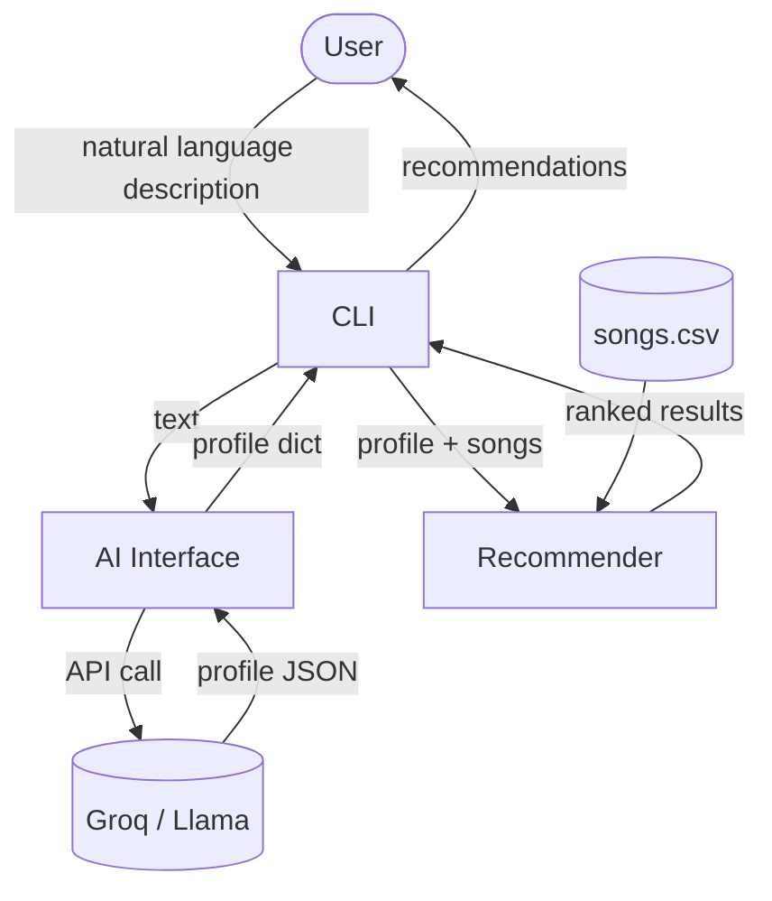

```mermaid
flowchart TD
    A([User]) -->|natural language description| B[CLI]
    B -->|text| C[AI Interface]
    C -->|API call| D[(Groq / Llama)]
    D -->|profile JSON| C
    C -->|profile dict| B
    B -->|profile + songs| E[Recommender]
    F[(songs.csv)] --> E
    E -->|ranked results| B
    B -->|recommendations| A
```
